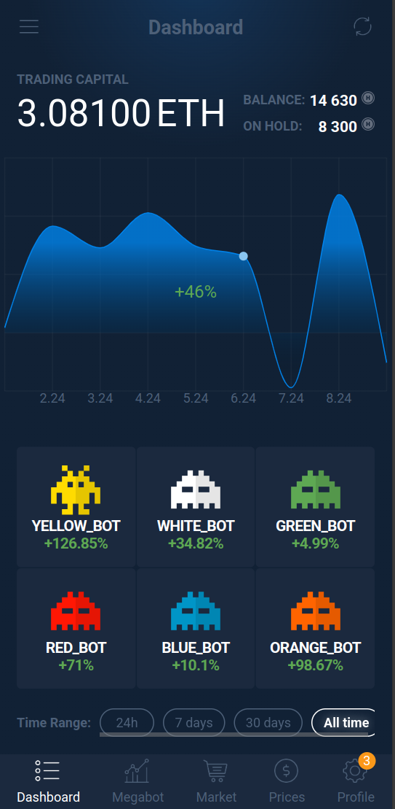
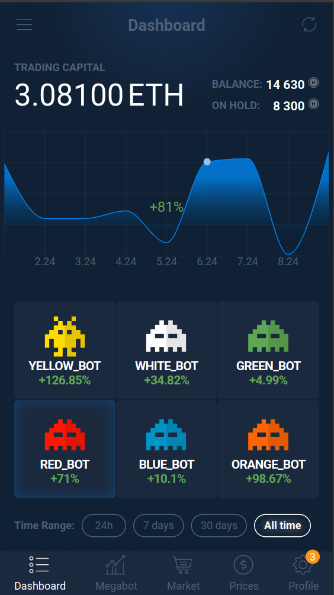

## Тестовое задание для front-end разработчика

Задание максимально приближена к реальным задачам, которыми предстоит заниматься front-end разработчику в нашей компании.

* Задача: нужно сверстать один экран приложения на основе React-компонентов
* При изменении интервала (24 часа, 7 дней, 30 дней, все время) нужно изменять показатели доходности ботов (проценты), используя данные из [json-файла](../frontend/src).
* Чтобы данные не исчезали при обновлении страницы, нужно сохранять их в localStorage.
* Браузер: запускать будем на iPhone 6S (Safari Mobile) и Samsung S8 Plus (Chrome). Нужно адаптировать страницу, чтобы на этих устройствах отсутствовал вертикальный и горизонтальный скролл, оно было полностью вписано в один экран браузера.
* Шрифт можно использовать Roboto или Open-Sans

* При переключении ботов (оранжевый, красный, желтый, зеленый, голубой) перерисовывать график случайным образом

| target  | result samsung s8 | result iphone6 |
| ------------- | ------------- | ------------- |
|  | |   |

